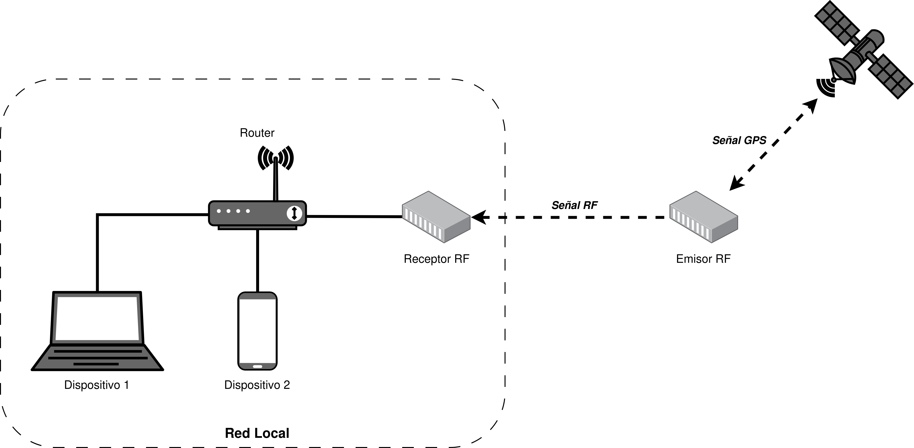
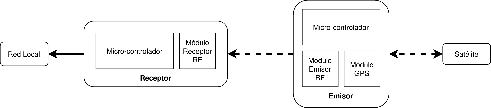
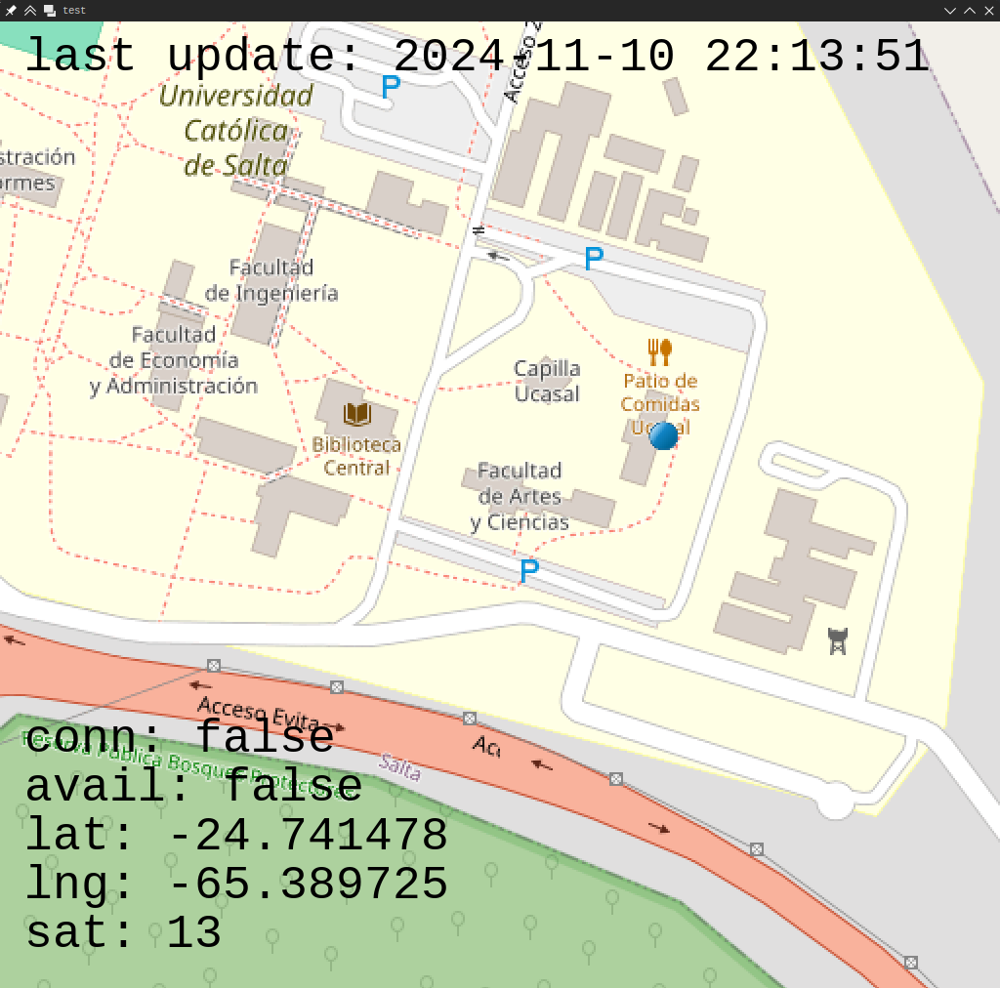

# GPS tracking using LoRa transceiver
A bunch of project files for a simple GPS tracking system
using the following:

- NodeMCU ESP8266
- Arduino Nano
- GY-NEO6MV2 GPS module
- SX1276 RFM95 LoRa transceivers

# Diagrams
 



# Client
You can use the system as a standalone service that provides
you with the data in JSON format by doing a GET request
to the NodeMCU.

Alternatively, you can use the client provided in the repo



# Building
You should first clone the repo with submodules

`git clone https://github.com/nesktf/lora_gps_tracking.git --recurse-submodules`

## NodeMCU & Arduino Nano
You should first add the NodeMCU board Manager in your IDE, add the
following URL in Preferences->Additional Boards Manager URL 
`http://arduino.esp8266.com/stable/package_esp8266com_index.json` and 
download the ESP8266 files in the boards manager.

Copy the files in `src/` inside your sketches folder, then
copy everything in `lib/` into your `libraries/` Arduino IDE folder.

Then just open the sketches and compile them as usual

## Client
The client was meant to be run in Debian 12 Bookworm. You should be
able to build it in other distros by installing the appropiate dependencies.

`sudo apt install cmake cmake-data extra-cmake-modules libglfw3-dev liblua5.3-dev libfmt-dev libglm-dev libfreetype-dev libopenal-dev libassimp-dev libcurlpp-dev`

Then you can build it and run it doing the following
```sh
cd client/
cmake -B build -DCMAKE_BUILD_TYPE=Release
make -C build -j$(nproc)
./build/osm_client
```

The client expects the `client/res/` folder and a `tile_cache/` folder in
your working directory.
